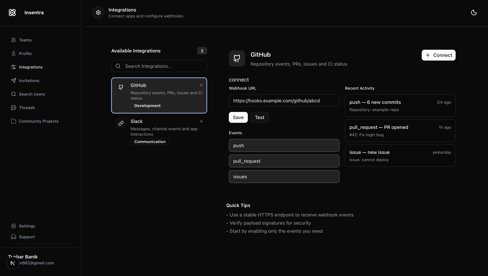

# Insentra

<div align="center">
  
  
  <h3>🚀 AI-Powered Project Management & Collaboration Platform</h3>
  
  <p>
    <em>Streamline your workflow, enhance collaboration, and harness the power of AI</em>
  </p>

[](https://choosealicense.com/licenses/mit/)
[](https://nextjs.org/)
[](https://www.typescriptlang.org/)
[](https://www.mongodb.com/)
[](https://vercel.com/)

</div>

---

## ✨ What Makes Insentra Special?

Insentra isn't just another project management tool—it's an intelligent ecosystem that bridges the gap between development workflows and team collaboration. By seamlessly integrating with GitHub and leveraging cutting-edge AI, Insentra transforms how teams manage projects, track progress, and collaborate in real-time.

### 🎯 Core Philosophy

- **AI-First Approach**: Every feature is enhanced with intelligent automation
- **Developer-Centric**: Built by developers, for developers
- **Real-Time Everything**: Live updates, instant notifications, seamless collaboration
- **Security-First**: Enterprise-grade security with modern authentication

---

## 🌟 Key Features

### 🤖 **AI-Powered Intelligence**

- **Smart Commit Summaries**: Gemini AI analyzes your commits and generates intelligent summaries
- **PR Insights**: Automated pull request analysis with impact assessment
- **Intelligent Thread Generation**: Auto-create discussion threads for GitHub events
- **Context-Aware Responses**: AI understands your project context for better assistance

### 🔗 **GitHub Integration Ecosystem**

- **Webhook-Driven Updates**: Real-time synchronization with GitHub events
- **Octokit-Powered API**: Robust GitHub API integration for seamless data flow
- **Repository Management**: Import, sync, and manage multiple repositories
- **Issue & PR Tracking**: Automatic thread creation for issues and pull requests

### 👥 **Advanced Collaboration**

- **Real-Time Threads**: Live discussion spaces with instant updates
- **Team Management**: Sophisticated role-based access control
- **Smart Invitations**: Streamlined team onboarding process
- **Activity Feeds**: Stay updated with real-time project activities

### 🎨 **Modern UI/UX**

- **shadcn/ui Components**: Beautiful, accessible, and customizable UI components
- **Radix UI Primitives**: Rock-solid foundation with excellent accessibility
- **Framer Motion**: Smooth, delightful animations and transitions
- **Lottie Animations**: Engaging micro-interactions and loading states
- **Dark/Light Mode**: Seamless theme switching with next-themes

### 📊 **Monitoring & Analytics**

- **Prometheus Metrics**: Comprehensive application monitoring
- **Performance Tracking**: Real-time performance insights
- **Usage Analytics**: Understand how your team uses the platform

---

## 🛠️ Tech Stack

### **Frontend & Framework**

- **[Next.js 15.4.5](https://nextjs.org/)** - React framework with App Router
- **[React 19](https://react.dev/)** - Latest React with concurrent features
- **[TypeScript 5](https://www.typescriptlang.org/)** - Type-safe development
- **[Tailwind CSS 3](https://tailwindcss.com/)** - Utility-first CSS framework

### **UI & Design System**

- **[shadcn/ui](https://ui.shadcn.com/)** - Modern component library
- **[Radix UI](https://www.radix-ui.com/)** - Accessible component primitives
- **[Lucide React](https://lucide.dev/)** - Beautiful icon library
- **[Framer Motion](https://www.framer.com/motion/)** - Production-ready motion library
- **[Lottie React](https://lottiefiles.com/)** - Lightweight animations
- **[next-themes](https://github.com/pacocoursey/next-themes)** - Theme management

### **Authentication & Security**

- **[Better Auth](https://www.better-auth.com/)** - Modern authentication solution
- **[JSON Web Tokens](https://jwt.io/)** - Secure token-based authentication
- **OAuth Integration** - GitHub & Google social authentication

### **Database & Storage**

- **[MongoDB 6.18](https://www.mongodb.com/)** - NoSQL database
- **[Mongoose 8.17](https://mongoosejs.com/)** - Elegant MongoDB object modeling

### **AI & External APIs**

- **[Google Gemini AI](https://ai.google.dev/)** - Advanced AI for content generation
- **[Octokit](https://octokit.github.io/rest.js/)** - GitHub API client
- **GitHub App Integration** - Webhook handling and repository access

### **State Management & Data Fetching**

- **[Zustand](https://zustand-demo.pmnd.rs/)** - Lightweight state management
- **[TanStack Query](https://tanstack.com/query)** - Powerful data synchronization
- **[Axios](https://axios-http.com/)** - HTTP client for API requests

### **Development & Deployment**

- **[Turbopack](https://turbo.build/pack)** - Ultra-fast bundler for development
- **[ESLint](https://eslint.org/)** - Code linting and quality
- **[Prettier](https://prettier.io/)** - Code formatting
- **[Husky](https://typicode.github.io/husky/)** - Git hooks for quality control
- **[Docker](https://www.docker.com/)** - Containerization support
- **[Vercel](https://vercel.com/)** - Deployment and hosting

### **Monitoring & Observability**

- **[Prometheus](https://prometheus.io/)** - Metrics collection and monitoring
- **[prom-client](https://github.com/siimon/prom-client)** - Prometheus metrics for Node.js

### **Validation & Utilities**

- **[Zod](https://zod.dev/)** - TypeScript-first schema validation
- **[clsx](https://github.com/lukeed/clsx)** - Conditional className utility
- **[tailwind-merge](https://github.com/dcastil/tailwind-merge)** - Merge Tailwind classes

---

## 🚀 Quick Start

### Prerequisites

- **Node.js 18+** (LTS recommended)
- **Bun** (preferred) or npm/yarn
- **MongoDB** instance
- **GitHub App** (for integrations)
- **Google AI API Key** (for AI features)

### 1. Clone & Install

```bash
git clone https://github.com/Tushar98644/Insentra.git
cd Insentra
bun install
```

### 2. Environment Setup

Create a `.env.local` file using `.env.example` as template:

```bash
cp .env.example .env.local
```

Configure your environment variables:

```env
# Database
MONGODB_URI=your_mongodb_connection_string

# Authentication
BETTER_AUTH_SECRET=your_secret_key
BETTER_AUTH_URL=http://localhost:3000

# GitHub Integration
GITHUB_CLIENT_ID=your_github_client_id
GITHUB_CLIENT_SECRET=your_github_client_secret
GITHUB_APP_ID=your_github_app_id
GITHUB_APP_PRIVATE_KEY=your_github_app_private_key

# Google AI
GOOGLE_API_KEY=your_gemini_api_key

# OAuth Providers
GOOGLE_CLIENT_ID=your_google_client_id
GOOGLE_CLIENT_SECRET=your_google_client_secret
```

### 3. Development Server

```bash
bun dev
```

Visit [http://localhost:3000](http://localhost:3000) to see your application running!

---

## 🐳 Docker Deployment

### Development Environment

```bash
docker-compose -f docker/docker-compose.yml up --build
```

### Production Environment

```bash
docker-compose -f docker/docker-compose.prod.yml up --build
```

---

## 🏗️ Project Architecture

```
src/
├── app/                    # Next.js App Router
│   ├── api/v1/            # API routes
│   ├── dashboard/         # Dashboard pages
│   └── (auth)/           # Authentication pages
├── components/            # Reusable UI components
│   ├── ui/               # shadcn/ui components
│   ├── layout/           # Layout components
│   └── common/           # Common components
├── features/             # Feature-based modules
│   ├── projects/         # Project management
│   ├── threads/          # Discussion threads
│   ├── users/            # User management
│   └── integrations/     # External integrations
├── lib/                  # Utility libraries
├── services/             # Business logic services
├── hooks/                # Custom React hooks
├── types/                # TypeScript definitions
├── db/                   # Database models & client
└── config/               # Configuration files
```

---

## 🔧 Key Integrations

### GitHub App Setup

1. Create a GitHub App in your organization
2. Configure webhook URL: `https://your-domain.com/api/v1/github/webhook`
3. Set required permissions: `Contents`, `Issues`, `Pull requests`, `Metadata`
4. Generate and download private key

### Webhook Events

Insentra automatically handles these GitHub events:

- **Push Events**: Commit summaries with AI analysis
- **Pull Request Events**: PR insights and impact analysis
- **Issue Events**: Automatic thread creation
- **Repository Events**: Sync and management

### AI Features

- **Commit Analysis**: Gemini AI analyzes code changes and generates summaries
- **PR Insights**: Intelligent pull request impact assessment
- **Smart Suggestions**: Context-aware recommendations

---

## 📊 Monitoring & Metrics

Access Prometheus metrics at `/api/v1/metrics`:

- Request duration and frequency
- Database connection status
- GitHub API usage
- AI service performance
- User activity metrics

---

## 🤝 Contributing

We welcome contributions! Please see our [Contributing Guide](CONTRIBUTING.md) for details.

### Development Workflow

1. Fork the repository
2. Create a feature branch: `git checkout -b feature/amazing-feature`
3. Make your changes and add tests
4. Run linting: `bun lint`
5. Format code: `bun format`
6. Commit changes: `git commit -m 'Add amazing feature'`
7. Push to branch: `git push origin feature/amazing-feature`
8. Open a Pull Request

---

## 📄 License

This project is licensed under the MIT License - see the [LICENSE](LICENSE) file for details.

---

## 🙏 Acknowledgments

- **[shadcn](https://twitter.com/shadcn)** for the amazing UI component library
- **[Vercel](https://vercel.com/)** for the excellent deployment platform
- **[GitHub](https://github.com/)** for the powerful API and integration capabilities
- **[Google](https://ai.google.dev/)** for the Gemini AI platform
- **Open Source Community** for the incredible tools and libraries

---

<div align="center">
  <p>Built with ❤️ by the Insentra team</p>
  <p>
    <a href="https://github.com/Tushar98644/Insentra/issues">Report Bug</a> •
    <a href="https://github.com/Tushar98644/Insentra/issues">Request Feature</a> •
    <a href="https://github.com/Tushar98644/Insentra/discussions">Discussions</a>
  </p>
</div>
